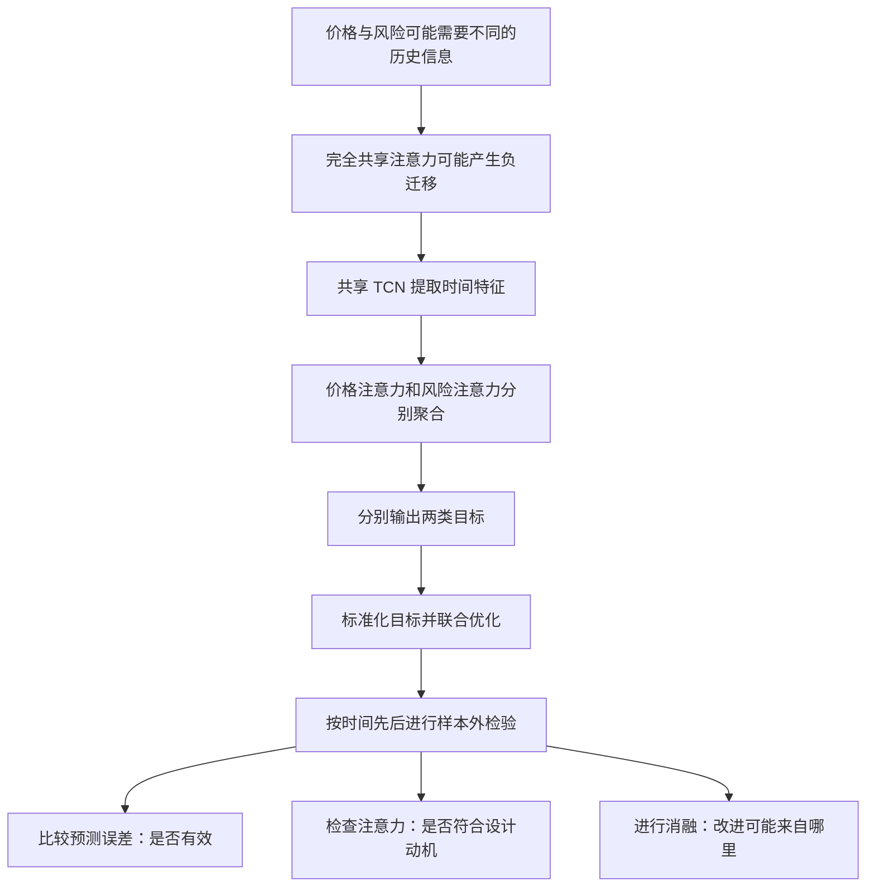

# FIN-MIND 全文逻辑解读：从研究问题到可验证结论

首次阅读建议先看 [研究流程解读](研究流程解读.md)，建立数据、模型和实验的整体关系。本文保留逐节展开的论证、公式和审计细节，供进一步核查。

本文面向本项目的论文阅读与复现。原文是 Minli Yang 等人的 [FIN-MIND v1](https://doi.org/10.20944/preprints202510.2049.v1)，2025 年 10 月发布，尚未经同行评审。[原始全文](https://www.preprints.org/manuscript/202510.2049/v1/download)标注 CC BY 4.0；本解读由项目独立撰写，不是逐句翻译，也不是作者对疑点的回复。

阅读时区分三种信息：**原文主张**是作者提出或报告的内容；**逻辑分析**是本项目对推理是否成立的判断；**实现约定**是为运行代码而明确选定的工程方案。文中的代码解释与数学推导属于后两者，不应被误写为论文公布的细节。

## 一、先理解全文试图证明什么

文章围绕一个多任务学习问题展开：两个预测目标可以共享历史信息，但未必应该以相同方式使用这些信息。作者将这一问题落实到价格与风险联合预测，提出共享时间特征提取器、分开任务注意力的架构。正文依次安排引言、相关工作、方法、实验、局限和结论。[依据：原文第 1–6 节](https://www.preprints.org/manuscript/202510.2049/v1/download)。

下面是理解文章的论证地图，而不是未经检验的因果事实：



这条链上有三种不同层次的问题。第一，模型结构在计算上是否成立？第二，在指定数据和训练方案下，预测误差是否下降？第三，误差下降是否确实由“减少任务冲突”造成？写出网络、得到更低误差、解释改进原因，分别需要不同证据，不能互相替代。

## 二、摘要与引言：动机如何导向研究问题

### 2.1 为什么把价格和风险放在同一个系统里

对预测问题而言，价格描述资产水平或变化，风险指标描述不稳定程度或收益与波动的关系。两者通常由同一段市场历史产生，分开建模可能重复学习一部分特征；联合学习因此有潜在的样本利用优势。

但“存在关联”不等于“最优表示完全一致”。例如，一次近期跳涨对下一日价格预测的作用，可能不同于它对未来波动估计的作用。这个例子说明任务专门化的必要性是一种合理假设，但它本身不是经验验证。

### 2.2 负迁移在这里是什么意思

如果优化风险任务后，价格任务的验证误差反而变大，就可能发生负迁移。问题不在于两个目标是否都能输出，而在于共享参数是否同时帮助它们。

因此，一个有说服力的实验需要同时保留单任务模型、共享多任务模型与部分解耦的多任务模型。只有比较它们，才能区分“增加一个任务是否有益”和“如何共享是否有益”。

### 2.3 引言的假设不能被读成定律

短期与长期信息的划分是设计动机，不应先验认定所有价格信号都短期、所有风险信号都长期。价格可能有长期趋势，风险也可能在一个交易日内突变。模型的价值在于允许任务自行学习不同的信息权重，而不是强行规定某一任务只能看某个区间。

同理，“因果”至少有两层含义：时间上的因果约束要求不使用预测时点以后才知道的信息；经济因果则要求识别某事件对价格的作用。一个左填充卷积可以解决前一层的一部分问题，不能据此获得后一层结论。

## 三、相关工作：如何看出方法的研究位置

原文相关工作依次讨论经典预测方法、深度时序方法、风险建模与多任务学习。[依据：原文第 2 节](https://www.preprints.org/manuscript/202510.2049/v1/download)。阅读这一安排时，更有用的问题是“每一组工作引出了什么待解决问题”：

| 方法类别 | 本解读建议关注的问题 | 对复现的启示 |
|---|---|---|
| 统计时序模型 | 简单结构能否已解释主要可预测部分？ | 必须保留简单基线，不能只比较复杂网络 |
| 深度时间特征提取 | 如何编码较长历史并控制训练成本？ | 卷积窗口、层数和感受野必须明确 |
| 注意力方法 | 预测时应给哪些历史状态较大权重？ | 应说明权重在哪个维度归一化、怎样聚合 |
| 风险预测 | 被预测的风险量究竟如何定义？ | 标签公式与模型同样重要 |
| 多任务方法 | 哪些参数共享、哪些参数独立？ | 消融设计应直接对应共享假设 |

引用了某类模型，只能说明它属于研究背景；只有提供相同数据口径和评估协议下的结果，才能形成实证比较。原文摘要提及 Transformer 对比，而主结果表列出的模型未提供对应 Transformer 行。这是证据覆盖范围的问题，不能把相关工作中的模型名称都算作已完成实验的基线。[核对位置：摘要、第 4.2 节与表 1](https://www.preprints.org/manuscript/202510.2049/v1/download)。

## 四、方法：从输入到输出逐层理解

### 4.1 首先定义任务，随后才有网络

文章使用历史信息预测次日开盘、收盘、波动率和 Sharpe，强调特征可用时点及训练集标准化。[依据：原文第 3.2 节](https://www.preprints.org/manuscript/202510.2049/v1/download)。

在本项目中，一条样本明确表示为：

```text
已知信息：截至交易日 t 收盘的 L 行特征
输入形状：[L, F]
目标日期：下一条实际交易记录 t+1
目标形状：[4]
```

这里“次日”是下一交易记录，不是机械地给日历日期加一天。不同股票不能直接拼成一条连续序列；周末也不能凭空补出可交易价格。

原始用户代码只有单个合成序列和固定滞后组合，因此首先需要改的是数据与任务契约。单纯把变量改成 `price` 或 `risk`，不会使它成为价格与风险联合预测。

### 4.2 风险标签为何是本次复现的关键不确定项

“风险”不是一个天然唯一的监督标签。可以用日内高低价波动代理，也可以用过去若干日收益的标准差；不同定义改变预测难度和指标量纲。

Sharpe 还需要明确收益样本集合、无风险利率、标准差口径及年化方式。单个日收益无法直接给出有意义的样本标准差，因此把“下一日 Sharpe”理解为“只用下一日一个收益率计算 Sharpe”是不充分的。

本项目采用的是**实现约定**：预测截至 t+1 的尾随 W 日统计量。设日简单收益为 r，默认 W=20：

\[
\sigma_{t+1}=\sqrt{252}\,\operatorname{std}(r_{t-W+2},\ldots,r_{t+1}),
\]

\[
S_{t+1}=\sqrt{252}\,
\frac{\operatorname{mean}(r_{t-W+2},\ldots,r_{t+1})-r_f^{daily}}
{\max(\operatorname{std}(r_{t-W+2},\ldots,r_{t+1}),10^{-8})}.
\]

这与“预测未来连续 W 天的风险”是两个不同任务。前者相邻标签共享 W−1 个收益，通常具有很强的持续性，所以“明天风险等于今天风险”是必要基线。若改成未来 W 天标签，训练样本的标签终点会延伸到未来；训练/验证边界需要按这个终点剔除跨界标签，不能沿用当前一天预测的切分逻辑。

Sharpe 更准确地说是风险调整后的收益指标，也不是尾部损失、违约概率或 VaR 的替代品。本项目所预测的四个数，并不自动构成完整风险管理系统。

### 4.3 TCN 负责把历史压成可供任务使用的表示

本项目的 `CausalConv` 采用左填充，卷积结果在某一时刻只依赖该时刻及更早输入。膨胀卷积让相邻核元素之间留出间隔；堆叠较少层也能覆盖较长历史。残差连接让网络学习对输入表示的修正，而不必每一层重新生成全部信息。

默认每个残差块有两次卷积。对核宽 k、块数 B，代码中的理论卷积感受野是：

\[
R=1+2(k-1)\sum_{b=0}^{B-1}2^b
 =1+2(k-1)(2^B-1).
\]

这个公式描述的是**当前代码的结构**，不代表论文披露了每块相同的卷积次数。默认 k=3、B=6 得到 R=253，但输入只有 192 行时，网络不可能看到第 193 行以前的实际数据；额外范围落在填充位置。

计算因果性还需要整个链条配合。如果输入特征本身使用了居中滚动窗口，或者标准化器看过全样本，即使卷积严格左填充，结果仍会泄漏。

### 4.4 双注意力决定各任务怎样读取共享表示

共享骨干输出 H 后，价格与风险各自计算一组 Q、K、V。可以将 Q 理解为“当前需要寻找的线索”，K 为“历史状态的检索特征”，V 为“检索后实际汇总的内容”。这是帮助理解的类比，不是把向量赋予固定金融含义。

本项目采用标准缩放点积形式：

\[
a_{ij}=\operatorname{softmax}_{j}
\left(q_i^{\mathsf T}k_j/\sqrt{d}\right),\qquad
o_i=\sum_{j\le i}a_{ij}v_j.
\]

未来位置与无效填充位置被排除，softmax 沿每个查询对应的键维度计算。每个有效查询的权重之和为 1；填充查询不能进入最终均值池化。

双注意力的独立性是**参数独立**。两条分支仍接收同一个 H，骨干梯度仍是任务梯度的加权和。若两任务对骨干提出相反更新方向，冲突仍可能存在。因此，可检验的说法是“此设计可能缓解冲突”，而不是“数学上消除了所有跨任务干扰”。

本实现使用 PyTorch SDPA 做常规前向计算；需要查看权重时可使用 `return_attention=True`。返回的图只是模型权重，不自动等于金融变量的重要性或经济原因。

### 4.5 池化会影响注意力图的解释

`CausalAttention` 先形成各时刻的上下文，再对有效时刻求均值。它与“只使用最后一个查询的上下文”不是同一个模型。

有一个容易忽略的数学细节：若长度为 T，且第 i 个查询对所有可见键均匀分配权重，那么均值池化以后，第 j 个键的有效系数为：

\[
w_j=\frac1T\sum_{i=j}^{T}\frac1i.
\]

这是本解读的推导。越早的键有机会出现在越多查询中，所以即使每个查询都没有学到特殊偏好，聚合后的图也可能偏向较早位置。解读注意力图前，必须说明画的是末端查询、所有查询的平均，还是池化后的有效权重。

因此，要验证“价格与风险偏好不同时间尺度”，应固定相同的窗口、滞后坐标与聚合口径，并跨种子检查稳定性。图形不同只能提供机制相容的迹象，不能单独证明预测提升来自该机制。

### 4.6 两组输出头与四维标准化

每条任务分支最终通过一个 MLP 输出两个数。本实现的价格头对应开盘和收盘，风险头对应波动率和 Sharpe。

原始目标的数值尺度可能相差很大。直接把美元平方误差与波动率平方误差相加，价格很容易主导优化。因此代码对四个目标分别使用当折训练均值和标准差，再在评估时反变换。

四维各自标准化之后，训练误差具有可比较的尺度；但反变换后的波动率和 Sharpe 仍不是同一单位，报告时不能随意平均为一个原始 `risk_rmse`。

### 4.7 损失中的不确定性不是预测出的市场波动率

原文采用不确定性加权多任务目标。[依据：原文第 3.6 节](https://www.preprints.org/manuscript/202510.2049/v1/download)。本项目将任务 m 的可学习对数方差记为 s_m，代码计算：

\[
\mathcal L=\frac12\sum_m
\left[e^{-s_m}\operatorname{MSE}_m+s_m\right].
\]

其中 `UncertaintyLoss.log_variance` 是每个输出维度一个可学习标量，用来控制误差项的权重；风险头输出的 volatility 是每个样本一个预测值。两者含义和变化方式完全不同。

为什么还需要加上 s_m？如果只保留误差项，增大方差就能把所有任务权重压到接近零。附加项约束这种退化。固定某一正的 MSE 并对 s 求导可得：

\[
\frac{\partial\mathcal L}{\partial s}
=\frac12\left(1-e^{-s}\operatorname{MSE}\right),
\]

其驻点满足 e^s=MSE。这是解释权重如何平衡的局部推导；实际训练中模型和损失参数同时变化，并非每步都达到该驻点。

这种权重学习既不保证每个任务同等重要，也不直接提供每个样本的预测置信区间。本项目的 `standardized_joint_mse` 只是另一项诊断统计量，不能与上式混为一谈。

## 五、实验：每类证据能回答什么

### 5.1 时间划分是实验的一部分

原文设置 AAPL/TSLA 的训练、内部验证与后续测试区间，并报告多种基线、风险结果、注意力与消融。[依据：原文第 4 节](https://www.preprints.org/manuscript/202510.2049/v1/download)。要复现这些结果，需要把自然语言的“滚动”展开成可执行日程。

在本项目中，先用 2015–2019 训练、2020 验证选择轮数；然后重新初始化，用可用的 2015–2020 数据重训；测试期间每 63 个交易日扩大训练集。63 日是实现选择，不是已经确认的作者配置。

过去测试日进入后续训练，不必然是泄漏：关键是它的标签在当前预测时点是否已知。反过来，即使始终使用一个固定模型，只要标准化器用过未来数据，也存在泄漏。

### 5.2 预测误差说明“有多准”，但不能单独说明“为什么”

MAE 给出典型绝对误差，RMSE 对大误差更敏感，R² 比较残差与测试标签自身波动。高 R² 不代表策略盈利，也不能证明没有泄漏；低误差也可能来自强持续性的目标。

由于价格水平具有持续性，必须比较“明日等于今日”。原有实验报告 `RESULTS.md` 中，这一基线依然略好于当前残差扩展。报告这一事实，比只展示网络能训练更有解释力。

本项目没有把论文表格数值与当前 TSLA 数值当作同口径结果：数据版本、复权价格尺度、测试终点、风险定义和参数都没有完全对齐。

### 5.3 消融实验旨在分离原因，但需要控制混杂因素

四种模型在当前代码中的作用是：

| 变体 | 直接比较的问题 | 解释时的限制 |
|---|---|---|
| `none` | 加入注意力后是否更好？ | 头部结构也发生变化，应考虑同时改变多个组件 |
| `shared` | 多任务共用一组注意力效果如何？ | 是共享机制的基线 |
| `price_only` | 增加风险任务是否帮助价格任务？ | 输出数和损失维度不同 |
| `decoupled` | 独立注意力的多任务模型是否更好？ | 参数量增加也可能影响结果 |

如果双注意力模型更好，仍需考虑是否只是容量增加。更强的机制实验可以额外加入参数量匹配的共享模型；若要讨论骨干中的梯度冲突，可以记录两任务梯度夹角或内积。这些是后续研究建议，本次尚未实施。

单次平均误差较小，不足以证明差异稳定。多种子测量初始化随机性，跨时段测量市场状态变化，两者不能互相替代。金融时序上的误差相关性也意味着，不能把每天的误差都当作独立样本套用任意显著性检验。

### 5.4 图形提供直观检查，不替代完整测试

预测曲线适合检查时间错位、滞后与局部异常，但一个展示区间不能代表全部测试集。

原文将图 2 描述为 2023 年 1–3 月的 90 个交易日。按日历独立核算，2023-01-01 至 2023-03-31 总共只有 65 个周一至周五日期，交易所假日还会进一步减少。因此该文字中的日期范围或样本数需要作者澄清；这不等于已经核实图中每个点的真实日期。[核对位置：原文第 4.2.1 节、图 2 说明](https://www.preprints.org/manuscript/202510.2049/v1/download)。

原文注意力讨论还涉及长达 180 日的历史滞后。当前已运行的轻量配置窗口为 64，最大直接历史滞后为 63，因此该次试跑不能重现这种长滞后图；项目默认 192 窗口提供了相应历史长度，但还需要真实数据和明确绘图口径。[依据：原文第 4.2.3 节](https://www.preprints.org/manuscript/202510.2049/v1/download)。

## 六、局限与结论：如何控制结论强度

把全文的结论拆成四个层次更便于判断：

| 结论层次 | 所需证据 | 本项目状态 |
|---|---|---|
| 实现了架构 | 输入输出、因果遮罩、梯度和训练流程可验证 | 已实现并测试 |
| 在特定实验中降低误差 | 可核验的数据、协议、逐样本预测 | 已有有限区间结果，未优于持久性基线 |
| 改进来自任务冲突减少 | 严格消融及机制证据 | 尚不足以确认 |
| 可推广且有交易价值 | 新资产、新时期、成本与执行约束下验证 | 本次未开展 |

结构合理意味着值得试验，不意味着一定优于更简单模型。当前重建结果不理想，也不能单独否定论文方法：数据不完整、配置未充分对齐，正反两种强结论都超出了现有证据。

原文局限部分讨论适用数据、替代信息源、计算成本及事件解释等问题；将这些限制纳入结论，才能避免把有限日频实验推广为普遍有效的金融系统。[依据：原文第 5–6 节](https://www.preprints.org/manuscript/202510.2049/v1/download)。

## 七、复现中必须公开的疑点与假设

| 项目 | 已知情况或本项目核查 | 应怎样处理 |
|---|---|---|
| 风险标签 | 未找到唯一确定的窗口与 Sharpe 可执行公式 | 明确本项目 W=20 等约定，后续向作者核实 |
| 网络及优化参数 | 未获得完整作者配置 | 将窗口、宽度、层数、优化器和种子写入摘要 |
| 损失权重 | 方法使用学习权重，实验文字还提及手调 λ | 按方法实现，并保留文本不一致说明 |
| 数据覆盖 | 本地下载 AAPL 截至 2017-12-28，TSLA 截至 2021-10-14 | 保存源地址与 SHA-256，不能拼凑成完整原实验 |
| 滚动评估 | 原文未给出足够细的重训时间表 | 把 63 日频率标记为实现约定 |
| 显著性 | 主表均值不足以还原逐种子差异 | 不自行补造置信区间或显著性结果 |
| 基线覆盖 | 背景或摘要提及的方法不等于表格已评估的方法 | 只按实际提供的实验报告对比范围 |

前三项与滚动协议为对[原文方法与实验章节](https://www.preprints.org/manuscript/202510.2049/v1/download)的复现审计；数据覆盖来自本项目 [数据来源记录](data/provenance.json)。当前下载版本不足，不意味着已经确定作者曾使用相同版本。

## 八、把论文逻辑映射到本项目代码

| 概念 | 文件与对象 | 需要检查的行为 |
|---|---|---|
| 数据契约 | `finmind/data.py`：`MarketData`、`load_csv` | 一资产一序列、复权一致、日期不重复 |
| 标签定义 | `prepare` | 滚动统计只看当前及过去，明确风险公式 |
| 时序样本 | `WindowDataset` | `x[i-L:i]` 对应 `y[i]` |
| 标准化 | `Standardizer`、`fit_scalers` | 只在当折训练样本拟合 |
| 因果卷积 | `finmind/model.py`：`CausalConv` | 左填充及正确膨胀间距 |
| 共享特征 | `ResidualBlock` | 所有任务接收同一骨干表示 |
| 解耦注意力 | `CausalAttention`、`FINMIND` | 两套独立 Q/K/V、遮罩、有效位置池化 |
| 联合损失 | `UncertaintyLoss` | 四个独立对数方差参数 |
| 滚动训练 | `finmind/train.py`：`run_walk_forward` | 当前测试块的标签不进入训练 |
| 指标导出 | `run_finmind.py`、`finmind/metrics.py` | 原始单位、按目标评估、日期可审计 |
| 扩展方案 | `modeling_targets` 的 `residual` 模式 | 用已知收盘价作为锚点并正确还原 |

原始固定滤波示例保存在 `baseline_original.py`。它的价值是保留优化前的出发点，不能承担论文架构的对照复现：预测对象和算法都不同，误差不能直接与美元指标比较。

本次残差扩展的计算是：

\[
\hat P_{t+1}=P_t+\widehat{\Delta P}_{t+1}.
\]

锚点 P_t 在预测时已知。这是针对直接价格外推问题的工程优化，不属于本项目已确认的论文原设计。该扩展是在初次试跑后加入的，所以现有对比应视作探索性结果，未来需冻结方案并使用未触及的测试集。

## 九、接下来怎样把“方法重建”推进为“数值复现”

先对齐数据，再对齐标签，随后对齐训练协议，最后讨论误差。建议的工作顺序是：

1. 获得完整的 AAPL/TSLA 数据版本、复权说明及交易日范围，并与作者数据来源对应。
2. 确认风险标签窗口、波动率估计式、Sharpe 定义和无风险利率处理；冻结标签生成脚本。
3. 补全作者的模型配置、种子和滚动计划；若仍无法取得，明确列出替代配置。
4. 先运行持久性基线，再在完全相同样本日期上运行单任务、共享注意力和双注意力。
5. 在训练/验证区间完成所有选择，再使用预留测试区间；对不同种子和时间段分别报告结果。
6. 独立核查注意力图的窗口、查询和滞后聚合方式；对照逐日预测检查图表与表格一致性。

项目当前完成的是可检查、可运行的方法重建与有限实验。全文最值得继续检验的研究命题是：在控制数据、容量和训练协议后，任务专属的历史信息聚合能否持续优于共享聚合及简单基线。
